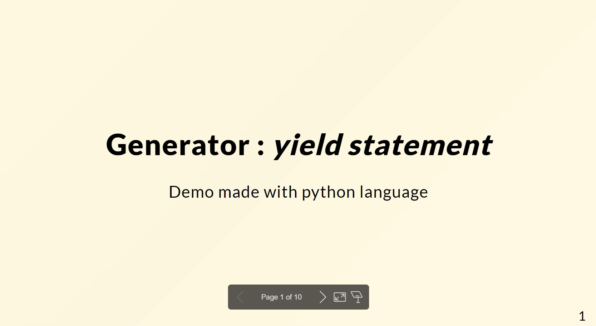

# Generator : *yield statement*

Demo code made with python language

# Demo

https://sfinx13.github.io/demo-generator/

----
# Overview

* What is a generator ?

* Can we should talk iterator first ?

* Why you should use it ?

* How to create a generator ?
    - `yield` statement
    - `()` expression

* Profiling Generator Performance.

Slides made with marp-app https://github.com/marp-team/marp
